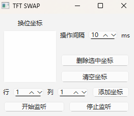

# TFT SWAP

**风险提示：如果你的换位棋子超过1个可能被怀疑非人类操作**



https://raw.githubusercontent.com/PyTFT/media/refs/heads/main/swap/swap.mp4

## 使用说明

- 支持分辨率 1920 x 1080，游戏需要无边框模式显示
- 必须以管理员权限运行
- 添加坐标，开始监听后，按"S"键换位
- 换位前需保证焦点在游戏内（点一下游戏）
- 脚本按从上到下的顺序换位，所以重要棋子往前放
- 坐标的“行”是从下往上数，最下为1行，最上为4行
- 坐标的“列”是从左向右数。左下角1,1 右下角1,7 左上角4,1 右上角4,7
- 每次换位后会自动反转坐标，方便换回
- 每行的3，4，5列换位更慢(慢80ms)，更容易失败，不建议使用这些坐标
- 操作间隔可根据自己的网络环境调整，越小换位越快，更容易失败，更不像人类操作
- 游戏PING值波动容易使换位失败
- 监听不影响增删坐标

## 测试环境及依赖

- Windows 11 x64
- Python 3.13
- PyDirectInput==1.0.4
- PySide6==6.8.1

##  运行

在项目根目录下以管理员权限运行
```bash
python main.py
```
点击左上角S图标打开
